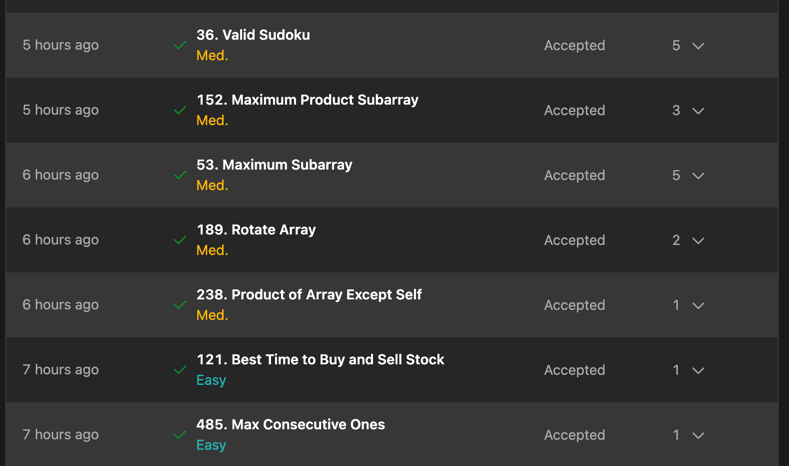

# Звіт: Модуль "Arrays & Lists in Python"

У цьому блоці я повторив структуру даних – Масиви.

## 1. Теоретична база
* **Типи масивів:** Розглянув різницю між динамічними та статичними масивами.
* **Аналіз операцій:** Дослідив швидкість виконання операцій видалення, вставлення та виведення даних ($O(n)$ vs $O(1)$).
* **Управління пам'яттю:** Зрозумів, як Python автоматично підбирає обсяг пам'яті, необхідний для динамічного масиву (over-allocation strategy).
* **Порівняння мов:** Розібрався, як у мовах Java та C++ організовані масиви та динамічні масиви, і в чому полягає їхня ключова різниця з реалізацією в Python.

---

## 2. Практична частина (LeetCode)
Всі задачі реалізовані мовою Python. Нижче наведено посилання на файли з кодом у папці `Arrays`:

* **[485. Max Consecutive Ones.py](485.%20Max%20Consecutive%20Ones.py)**
* **[121. Best Time to Buy and Sell Stock.py](121.%20Best%20Time%20to%20Buy%20and%20Sell%20Stock.py)**
* **[238. Product of Array Except Self.py](238.%20Product%20of%20Array%20Except%20Self.py)**
* **[189. Rotate Array.py](189.%20Rotate%20Array.py)**
* **[53. Maximum Subarray.py](53.%20Maximum%20Subarray.py)**
* **[152. Maximum Product Subarray.py](152.%20Maximum%20Product%20Subarray.py)**
* **[36. Valid Sudoku.py](36.%20Valid%20Sudoku.py)**

---
