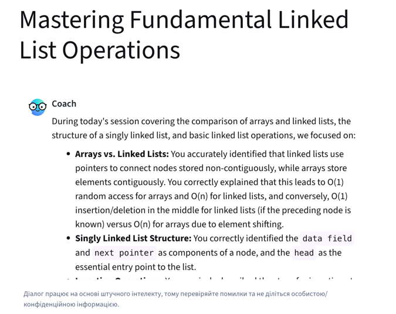
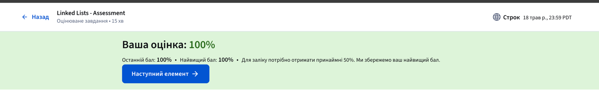

# Звіт: Модуль "Linked List"

У цьому розділі я повторив фундаментальну структуру даних  **Linked List** (Зв'язаний список).

## 1. Теоретична база
Зв'язаний список дозволяє виконувати ті самі операції, що й масив, проте має іншу логіку зберігання даних:
* **Розподіл у пам'яті:** Елементи (ноди) зберігаються не поряд, а в довільних місцях пам'яті.
* **Структура ноди:** Linked List займає більше пам'яті, ніж масив, оскільки кожна нода зберігає як самі дані, так і посилання на наступний елемент.

## 2. Складність операцій
Я дослідив часову складність основних маніпуляцій зі списком:
* **Додавання/Видалення з початку:** $O(1)$  виконується миттєво через зміну посилання `head`.
* **Додавання/Видалення з кінця:** $O(n)$  потребує повного проходу по списку для пошуку останнього чи передостаннього елемента.

## 3. Особливості реалізації в Python
Цікавим відкриттям стало те, що перевірка `if cur is None` працює швидше, ніж `if not cur`. 
* **Причина:** `is None`  це швидка перевірка ідентичності об'єкта. У випадку з `if not cur` Python спочатку перевіряє "істинність" об'єкта (наприклад, через виклик методу `__len__`), що створює додаткові операції.

Я імплементував базову структуру та логіку у наступних файлах:
* **[linked_list_init.py](linked_list_init.py)**  опис структури ноди та ініціалізація списку.
* **[inserting_to_linked_list.py](inserting_to_linked_list.py)**  реалізація вставки та видалення (з початку, середини та кінця).

---

## 4. Практична частина (LeetCode)
Я розв'язав задачі з курсу, що демонструють різні підходи до роботи зі звʼязними списками:

* **[2. Add Two Numbers.py](LeetCode%20Problems/2.%20Add%20Two%20Numbers.py)**
* **[19. Remove Nth Node From End of List.py](LeetCode%20Problems/19.%20Remove%20Nth%20Node%20From%20End%20of%20List.py)**
* **[21. Merge Two Sorted Lists.py](LeetCode%20Problems/21.%20Merge%20Two%20Sorted%20Lists.py)**
* **[141. Linked List Cycle.py](LeetCode%20Problems/141.%20Linked%20List%20Cycle.py)**
* **[142. Linked List Cycle II.py](LeetCode%20Problems/142.%20Linked%20List%20Cycle%20II.py)**
* **[160. Intersection of Two Linked Lists.py](LeetCode%20Problems/160.%20Intersection%20of%20Two%20Linked%20Lists.py)**
* **[206. Reverse Linked List.py](LeetCode%20Problems/206.%20Reverse%20Linked%20List.py)**
* **[234. Palindrome Linked List.py](LeetCode%20Problems/234.%20Palindrome%20Linked%20List.py)**
* **[876. Middle of the Linked List.py](LeetCode%20Problems/876.%20Middle%20of%20the%20Linked%20List.py)**

---

## 5. Підтвердження результатів
На завершення модуля я пройшов перевірку знань:
* **Спілкування з чат-ботом:** Відповів на контрольні питання по темі (результат на скріншоті `Passed_conversation_with_bot.png`).

* **Тестування:** Успішно склав тест на платформі (результат на скріншоті `Passed_test_on_the_platform.png`).

